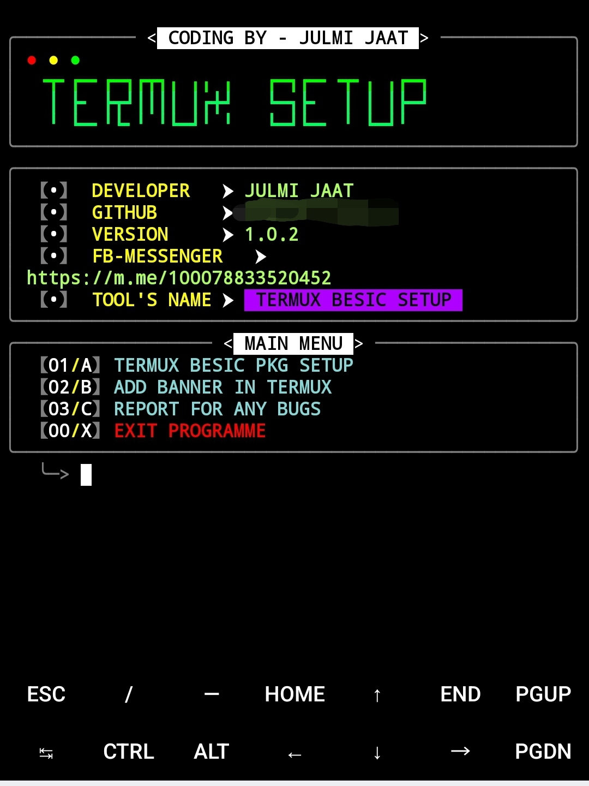
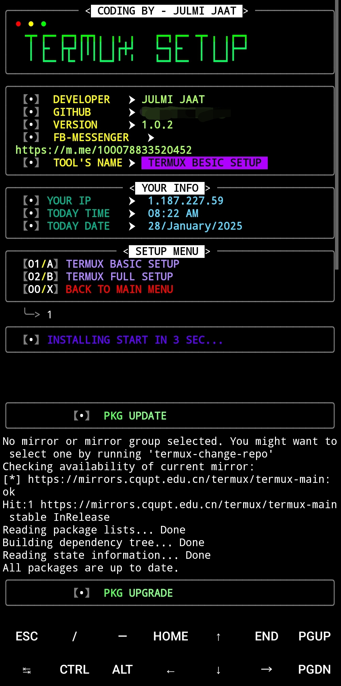

ये TERMUX टूल है जो आपकी TERMUX की आल सेटिंग करने मे हैल्प करता है अगर आपको कोई टूल या कुछ भी जानकारी चाहिए तो ओनर ◉❖जुल्मी≛जाट❖◉ से बात करो FACEBOOK ID👇👇https://www.facebook.com/julmijaat1008?mibextid=ZbWKwL
* 𝗡𝗢𝗧𝗘:-
* 𝐃𝐎 𝐍𝐎𝐓 𝐂𝐇𝐀𝐍𝐆𝐄 𝐀𝐍𝐘𝐓𝐈𝐍𝐆𝐇⛔ 
* 𝐀𝐆𝐑 𝐊𝐔𝐂𝐇 𝐂𝐇𝐀𝐍𝐆𝐄 𝐊𝐈𝐘𝐀 𝐓𝐎 𝐓𝐎𝐎𝐋 𝐁𝐀𝐍𝐃 𝐇𝐎 𝐒𝐀𝐊𝐓𝐀 𝐇𝐀𝐈 𝐔𝐒𝐊𝐄 𝐉𝐈𝐌𝐄𝐖𝐀𝐑 𝐀𝐀𝐏 𝐊𝐇𝐔𝐃 𝐇𝐎𝐆𝐄🚫
## <h3 align="center">

  <p align="center">  
  
</h3>

[](https://git.io/typing-svg)


[](https://wa.me/+919896692***)
[](https://www.facebook.com/julmijaat1008?mibextid=ZbWKwL)
[](https://https://instagram.com/_julmi_jaat__?igshid=OGQ5ZDc2ODk2ZA==)
[](https://m.me/100078833520452)
[](https://github.com/Jaat-brand)
[](https://youtube.com/@naveenkumar-yb3gu?si=YSfLxW0Ii3E5o4sV)


</p>
   <p align="center">
      <a href="https://github.com/JAAT-BRAND/TERMUX-SETUP/stargazers">
      </a>
      <a href="https://github.com/JAAT-BRAND/TERMUX-SETUP/releases/latest">
      </a>
      <a href="https://www.conventionalcommits.org/en/v1.0.0/">
      </a>
      <a href="https://github.com/JAAT-BRAND/TERMUX-SETUP/actions/workflows/github-action.yml">
      </a>
   </p>
   
</br>
<p align="center">

> Welcome to the **Termux Setup Tools**, a professional and user-friendly Bash script designed to optimize your Termux environment! This script installs essential packages, configures your terminal, tests internet speed, displays system information, and much more!  


## Language</br>

 <p align="center">


</p>

## Tested On >

* TERMUX
## **📖 How It Works**  

1. **Check & Install Packages**:  
   - The script checks if each package is already installed.  
   - Installs only missing packages, skipping those already present.  

2. **Update & Upgrade**:  
   - Ensures your Termux environment is up-to-date.  

3. **Optimize Storage**:  
   - Removes unnecessary files and caches to reclaim space. 

## **🛡️ Requirements**  

- Termux environment.  
- Internet connection for downloading packages.  

## INSTALL  ON TERMUX
```python
apt update && apt upgrade -y
pkg install git
pkg install python
pip install requests
rm rf-TERMUX-SETUP
git clone https://github.com/JAAT-BRAND/TERMUX-SETUP
cd TERMUX-SETUP
python SET.py
```


## TERMUX >

<p align="center">
<p align="center">

### Tools Languages :

<p align="center">

</p>

<br>

### Contributing
Feel Free To Clone This Project. For Major Changes, Please Open An Issue First To Discuss What You Would Like To Change Or Add, Thank You!!.

<h2 align="center">LICENSE</h2>

**TERMUX-SETUP** is released under the GNU General Public License v3.0, which grants the following permissions:
- Commercial use
- Distribution
- Patent use

## **❓ FAQ**  

### 1️⃣ What happens if a package is already installed?  
The script skips reinstallation and informs you with a message like:  
`Package xyz is already installed.`

For more convoluted language, see the [LICENSE](/LICENSE).
</br>

<h5 align="center"><b>DESCRIPTION</b></h5>

* ©️ Copyright Message
>> Copyright © [2025-27] [JAAT-BRAND]
>All rights reserved. This Python project, along with its code, documentation, and any associated files, is the intellectual property of JAAT CYBER. You may not reproduce, distribute, or modify the contents of this repository without explicit permission from the owner.
## Give A Star ⭐
> You can also give this repository a star to show more people and they can use this repository.
